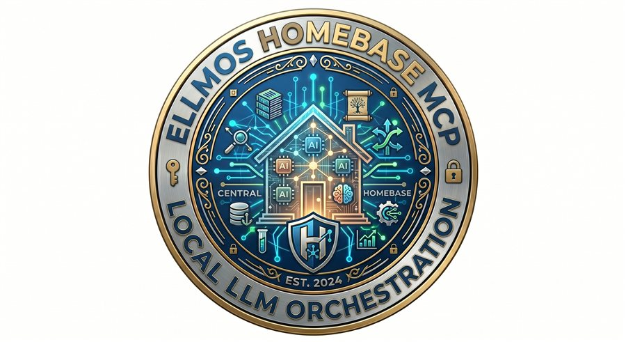
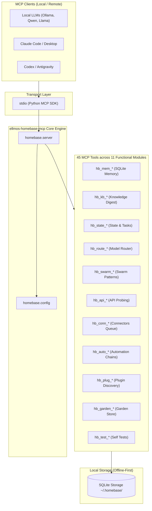
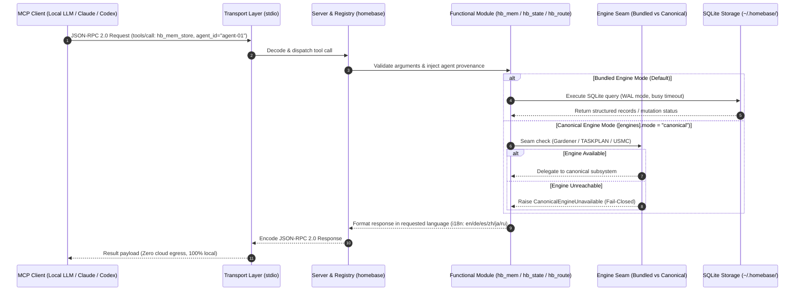

# ellmos-homebase-mcp

<p align="center">
  
</p>

Alpha MCP server for **local-first LLM orchestration**: memory, knowledge, routing, swarm patterns, API probing, persistent state, tests, automation planning, and plugin discovery in one stdio server.

Homebase is designed primarily for **local LLMs** (Ollama, Qwen, Llama, or any locally-hosted model via a MCP-capable harness). All persistent storage uses SQLite with no cloud dependency. External LLM providers (Claude, Codex, Gemini, OpenAI) can also connect as MCP clients, but local, offline-capable setups are the primary target.

German README: [README_de.md](README_de.md)

*Part of the [ellmos-ai](https://github.com/ellmos-ai) family.*

[](https://github.com/open-bricks)
[](https://github.com/ellmos-ai)
[](https://opensource.org/licenses/MIT)
[](https://www.npmjs.com/package/ellmos-homebase-mcp)
[](https://www.python.org/)
[](https://nodejs.org/)
[](https://github.com/ellmos-ai/ellmos-homebase-mcp)
[](SECURITY.md)
[-blueviolet.svg)](https://sqlite.org/)
[](https://modelcontextprotocol.io/)
[](https://www.npmjs.com/package/ellmos-homebase-mcp)
[](tests/)
[](llms.txt)
[](https://github.com/ellmos-ai/ellmos-homebase-mcp/actions/workflows/tests.yml)

**Discoverability:** Published on [npm](https://www.npmjs.com/package/ellmos-homebase-mcp) as `ellmos-homebase-mcp` and maintained in the [`ellmos-ai`](https://github.com/ellmos-ai) organization.

> [!NOTE]
> **For AI Assistants & LLM Agents:** Machine-readable architecture summary, index, and tool capabilities are published in [llms.txt](llms.txt). MCP registry metadata is available in [server.json](server.json).

## Quick Navigation / Schnellnavigation

- [System Architecture](#system-architecture)
- [Sequence Flow & Lifecycle](#sequence-flow--lifecycle)
- [Core Capabilities & Security Invariants](#core-capabilities--security-invariants)
- [Start Here](#start-here)
- [Status](#status)
- [Install](#install)
- [MCP Client Configuration](#mcp-client-configuration)
- [Server Configuration](#server-configuration)
- [Tools](#tools)
- [Discovery Context](#discovery-context)
- [ellmos-ai Ecosystem](#ellmos-ai-ecosystem)
- [Security & Vulnerability Reporting](#security--vulnerability-reporting)
- [Development](#development)
- [Deutsche Version (README_de.md)](README_de.md)

## System Architecture



## Sequence Flow & Lifecycle



## Core Capabilities & Security Invariants

| Capability / Invariant | Guarantee | Technical Implementation |
|---|---|---|
| **100% Local-First & Zero-Egress** | Complete privacy and offline operation; no unexpected cloud communication or telemetry. | All persistent memory, knowledge, and state are saved in local SQLite (`~/.homebase/`). |
| **Strict Engine Seams & Fail-Closed** | No silent fallback into disconnected databases when requesting canonical systems. | [`MODE-CONTRACT.md`](MODE-CONTRACT.md) enforcement: raises `CanonicalEngineUnavailable` if target is unreachable. |
| **Team-Memory Provenance (`agent_id`)** | Deterministic audit trail and filterable ownership for multi-agent workflows. | Native `agent_id` tracking across memory facts, knowledge entries, and task state. |
| **Credential-Free Discovery & Planning** | Zero secret exposure during local routing recommendations and API probing. | `hb_route_*`, `hb_swarm_*`, and `hb_api_*` run without transmitting API keys or private tokens. |
| **Safe Plan-and-Queue Adapters** | Safe queueing and chain staging without arbitrary remote code execution. | `hb_conn_*` and `hb_auto_*` maintain plan-only queues and offline staging records. |
| **Full Native i18n Localization** | Seamless multilingual developer and agent interaction. | Localized tool descriptions and JSON schemas for `en`, `de`, `es`, `zh`, `ja`, `ru`. |
| **Non-Elevation & Secret Hygiene** | Unprivileged execution and strict credential exclusion from distribution. | Non-root compatibility; live configs/secrets ignored in `.gitignore` and `.npmignore`. |
| **Multi-OS CI Smoke Integrity** | Verified cross-platform reliability on all major operating systems. | Multi-version CI matrix covering Python 3.10–3.13 and Node.js 20–24 on Linux/Windows/macOS. |

## Start Here

| Need | Entry point |
|---|---|
| Install the alpha MCP server | `npm install -g ellmos-homebase-mcp@alpha` |
| Run from a source checkout | `python -m homebase.server` with `PYTHONPATH=src` |
| Configure a local LLM harness, Claude Code, Codex, or any MCP client | [MCP Client Configuration](#mcp-client-configuration) |
| Inspect the machine-readable project summary | [llms.txt](llms.txt) |
| Check registry metadata | [server.json](server.json) |

## Status

- Transport: stdio via the Python MCP SDK
- Package status: public alpha package under `ellmos-ai`
- Release metadata: MIT `LICENSE`, `CHANGELOG.md`, `llms.txt`, and MCP Registry metadata in `server.json`
- Test gate: GitHub Actions covers Python 3.10/3.11/3.12 plus Node.js 20/22/24 smoke and npm package checks
- Current core: module discovery, MCP tool listing, MCP tool dispatch, config fallbacks, local planning/probing/queue/dry-run adapters
- Real local SQLite modules: `hb_mem_*`, `hb_kb_*`, `hb_garden_*`, `hb_state_*`
- Engine seams: `hb_garden_*`, `hb_state_task_*` and `hb_mem_*` can delegate to the real
  canonical Gardener/Rinnsal/USMC engines instead of the bundled SQLite copies via
  `[engines].mode = "canonical"` (default remains `"bundled"` for a zero-dependency install).
  **No silent fallback:** if you request `canonical` and the engine is unreachable, those tools
  return an error rather than quietly using the bundled DB — the server still starts and lists
  its tools. Binding rule and migration notes: **[MODE-CONTRACT.md](MODE-CONTRACT.md)**;
  mechanism: [KONZEPT.md](KONZEPT.md#engine-seams-canonicalbundled--umsetzungsstand-2026-07-04-ticket-t-20260704-01).
- Team-memory basics: `agent_id` provenance and filters for memory, knowledge, state memory, and tasks; SQLite uses WAL plus a busy timeout for safer concurrent agents
- Credential-free alpha adapters: `hb_route_*`, `hb_swarm_*`, `hb_api_*`, `hb_test_*`, `hb_conn_*`, `hb_auto_*`, `hb_plug_*`
- i18n: fully localized MCP tool descriptions, input-schema field descriptions, and unknown-tool errors for `en`, `de`, `es`, `zh`, `ja`, `ru` (English fallback for any unset key)
- Roadmap: optional real LLM/API integrations and explicit execution backends

## Install

The npm package contains a Node wrapper that starts the Python server. You still need Python 3.10+ and the Python package `mcp>=1.0.0`.

### Option 1: Install From npm

```powershell
npm install -g ellmos-homebase-mcp@alpha
ellmos-homebase
```

### Option 2: Install From Source

```powershell
git clone https://github.com/ellmos-ai/ellmos-homebase-mcp.git
cd ellmos-homebase-mcp
$env:PYTHONIOENCODING = "utf-8"
python -m pip install -e ".[dev]"
python -m pytest -q
```

Avoid creating a `.venv` inside cloud-synced folders if your sync client locks files. If you need an isolated environment, create it outside that folder.

## Start From Source

```powershell
$env:PYTHONPATH = "src"
python -m homebase.server
```

## MCP Client Configuration

Homebase uses the standard stdio `mcpServers` configuration format. The same snippet works in any MCP-capable client or harness: BACH/Buddha (local Ollama), Claude Code, Codex, Cursor, or any other MCP host.

> **Note on local LLMs:** A bare Ollama instance does not speak MCP natively — you need a MCP-capable harness on top of it (e.g., BACH, an open-source MCP proxy, or another orchestration layer). Configure that harness to include Homebase as an MCP server using the snippet below.

### Global npm Install

```json
{
  "mcpServers": {
    "homebase": {
      "command": "ellmos-homebase"
    }
  }
}
```

### Source Checkout

```json
{
  "mcpServers": {
    "homebase": {
      "command": "python",
      "args": ["-m", "homebase.server"],
      "env": {
        "PYTHONPATH": "/absolute/path/to/ellmos-homebase-mcp/src"
      }
    }
  }
}
```

Replace `/absolute/path/to/ellmos-homebase-mcp` with your local checkout path.

## Server Configuration

Example: [config/homebase.example.toml](config/homebase.example.toml)

Machine-readable project context: [llms.txt](llms.txt)

MCP Registry metadata: [server.json](server.json)

Default paths:

- `%USERPROFILE%\.homebase\homebase.toml`
- `%USERPROFILE%\.config\homebase\homebase.toml`
- override with `HOMEBASE_CONFIG`

Language can be configured with `[server].language`, `HOMEBASE_LANG`, or `HOMEBASE_LOCALE`.
The writing agent can be passed per tool call as `agent_id`; otherwise modules use
`HOMEBASE_AGENT_ID`, `AGENT_ID`, a module-level `agent_id`, or `unknown`.

```toml
[server]
name = "ellmos-homebase"
language = "en" # en, de, es, zh, ja, ru

[modules]
enabled = ["mem", "route", "kb", "swarm", "state", "garden", "api", "test", "conn", "auto", "plug"]
```

Modules with missing optional dependencies are skipped without blocking server startup.

## Tools

Important tool groups:

- `hb_mem_*` for SQLite-backed memory
- `hb_kb_*` for SQLite-backed knowledge entries
- `hb_state_*` for persistent SQLite state and tasks
- `hb_garden_*` for a small SQLite garden store
- `hb_route_*` for credential-free model-routing recommendations and feedback stats
- `hb_swarm_*` for credential-free swarm planning patterns
- `hb_api_*` for passive HTTP API discovery with SQLite history
- `hb_test_*` for built-in metadata and smoke self-tests
- `hb_conn_*` for a local connector registry plus SQLite-backed inbox/outbox queues without network sends
- `hb_auto_*` for local automation chain definitions and queued plan-only runs without backend execution
- `hb_plug_*` for local plugin discovery and dry-run records without executing plugin code

## Discovery Context

Use `ellmos-homebase-mcp` when searching for a local-first, offline-capable MCP server that gives local LLMs (Ollama, Qwen, Llama, or similar) persistent memory, knowledge management, routing, and orchestration — without requiring any cloud dependency. External LLM providers can also use it as an MCP server, but local-first setups are the primary design target.

Good search phrases:

- `ellmos Homebase MCP server`
- `local-first LLM orchestration MCP`
- `MCP server SQLite memory knowledge routing`
- `offline agent orchestration MCP server`
- `MCP swarm planning persistent state API discovery`

Not the same as Elmo/ELMO voice tools, AllenAI ELMo embeddings, Eclipse LMOS, generic cloud agent platforms, or single-purpose MCP memory servers.

## ellmos-ai Ecosystem

This MCP server is part of the **[ellmos-ai](https://github.com/ellmos-ai)** ecosystem — AI infrastructure, MCP servers, and intelligent tools.

### MCP Server Family

| Server | Tools | Focus | npm |
|--------|-------|-------|-----|
| [FileCommander](https://github.com/ellmos-ai/ellmos-filecommander-mcp) | 46 | Filesystem, process management, interactive sessions, cloud-lock-safe operations | [`ellmos-filecommander-mcp`](https://www.npmjs.com/package/ellmos-filecommander-mcp) |
| [CodeCommander](https://github.com/ellmos-ai/ellmos-codecommander-mcp) | 22 | Code analysis, JSON repair, imports, diffs, regex | [`ellmos-codecommander-mcp`](https://www.npmjs.com/package/ellmos-codecommander-mcp) |
| [Clatcher](https://github.com/ellmos-ai/ellmos-clatcher-mcp) | 12 | File repair, format conversion, batch operations | [`ellmos-clatcher-mcp`](https://www.npmjs.com/package/ellmos-clatcher-mcp) |
| [n8n Manager](https://github.com/ellmos-ai/n8n-manager-mcp) | 18 | n8n workflow management via AI assistants | [`n8n-manager-mcp`](https://www.npmjs.com/package/n8n-manager-mcp) |
| [ControlCenter](https://github.com/ellmos-ai/ellmos-controlcenter-mcp) | 20 | MCP stack discovery, profile management, control plane | [`ellmos-controlcenter-mcp`](https://www.npmjs.com/package/ellmos-controlcenter-mcp) |
| **[Homebase](https://github.com/ellmos-ai/ellmos-homebase-mcp)** | **45** | **Local-first LLM memory, knowledge, state, routing, swarm orchestration** | **[`ellmos-homebase-mcp`](https://www.npmjs.com/package/ellmos-homebase-mcp)** (alpha) |
| [ServerCommander](https://github.com/ellmos-ai/ellmos-servercommander-mcp) | 8 | Server operations: health checks, log analysis, deploy dry-runs, mail diagnostics | [`ellmos-servercommander-mcp`](https://www.npmjs.com/package/ellmos-servercommander-mcp) (alpha) |
| [Blender Use](https://github.com/ellmos-ai/ellmos-blender-use-mcp) | 3 | Headless Blender asset QA and FBX reimport verification | [`ellmos-blender-use-mcp`](https://www.npmjs.com/package/ellmos-blender-use-mcp) (alpha) |
| [Open Compute](https://github.com/ellmos-ai/open-compute-mcp) | 10 | Model-agnostic computer use: capture, safety-gated actions, Windows UIA | [`open-compute-mcp`](https://www.npmjs.com/package/open-compute-mcp) (alpha) |

### AI Infrastructure

| Project | Description |
|---------|-------------|
| [BACH](https://github.com/ellmos-ai/bach) | Local-first text-based OS for LLM agents — 113+ handlers, 550+ tools, SQLite memory |
| [open-compute](https://github.com/ellmos-ai/open-compute) | Model-agnostic computer-use core powering Open Compute MCP |
| [clutch](https://github.com/ellmos-ai/clutch) | Provider-neutral LLM orchestration with auto-routing and budget tracking |
| [rinnsal](https://github.com/ellmos-ai/rinnsal) | Lightweight agent memory, connectors, and automation infrastructure |
| [ellmos-stack](https://github.com/ellmos-ai/ellmos-stack) | Self-hosted AI research stack (Ollama + n8n + Rinnsal + KnowledgeDigest) |
| [MarbleRun](https://github.com/ellmos-ai/MarbleRun) | Autonomous agent chain framework for Claude Code |
| [gardener](https://github.com/ellmos-ai/gardener) | Minimalist database-driven LLM OS prototype (4 functions, 1 table) |
| [ellmos-tests](https://github.com/ellmos-ai/ellmos-tests) | Testing framework for LLM operating systems (7 dimensions) |

### Desktop Software & Sibling Ecosystem

Our partner umbrella organization **[open-bricks](https://github.com/open-bricks)** and sister organizations maintain local-first, privacy-centric desktop software and developer tools:

| Application / Tool | Organization | Focus & Integration |
|---|---|---|
| [ProFiler](https://github.com/file-bricks/ProFiler) | `file-bricks` | Local-first desktop file organizer and PII-safe workspace exchange |
| [DokuZen](https://github.com/doc-bricks/DokuZen) | `doc-bricks` | Distraction-free Markdown & PDF documentation manager |
| [PDFtoPDFocr](https://github.com/doc-bricks/PDFtoPDFocr) | `doc-bricks` | Local-first PDF OCR and text layer embedding |
| [KnowledgeDigest](https://github.com/doc-bricks/KnowledgeDigest) | `doc-bricks` | Offline document summarization and embedding engine |
| [DevCenter](https://github.com/dev-bricks/DevCenter) | `dev-bricks` | Developer workspace hub and multi-repository management |
| [CodeBox](https://github.com/dev-bricks/CodeBox) | `dev-bricks` | Isolated sandbox runner and local code execution assistant |
| [MemoryHooker](https://github.com/ellmos-ai/memoryhooker-provenance) | `ellmos-ai` | Hook-based LLM memory provenance and session injection gate |
| [sqlite-transit-sync](https://github.com/ellmos-ai/sqlite-transit-sync) | `ellmos-ai` | Zero-dependency SQLite schema migration & replication layer |

## Security & Vulnerability Reporting

`ellmos-homebase-mcp` strictly adheres to local-first, zero-egress, and non-elevation security principles. Full policies, SLAs, and security guarantees are documented in [SECURITY.md](SECURITY.md):

- **Supported Versions**: `0.1.0-alpha.x`
- **Response SLA**: Initial acknowledgment and triage within **48 hours**.
- **Security Contacts**: `security@ellmos.ai` and `support@lukasgeiger.com`.
- **Private Advisory**: [GitHub Security Advisories](https://github.com/ellmos-ai/ellmos-homebase-mcp/security/advisories).

## Development

```powershell
$env:PYTHONIOENCODING = "utf-8"
$env:PYTHONDONTWRITEBYTECODE = "1"
python -m pytest -q
npm run smoke
npm pack --dry-run --json
```

Next useful step: add optional execution backends behind explicit configuration.

## Bundles and partners

Homebase MCP remains a standalone local-first MCP server. In the V4
composition it is an optional **MCP access surface** of the
`ellmos-memory-human-context-bundle`: a configured system may use it to reach
memory and human-context capabilities. This access role does not make Homebase
the canonical owner of every memory, knowledge, state, routing or automation
function; the selected host and system manifests retain those bindings.

Canonical or bundled engines are integration partners selected by explicit
configuration, not implicit replacements for this server. Authoritative
bundle membership, versions, profiles and private composition recipes remain
in the corresponding bundle manifests. This public section is discovery-only.
