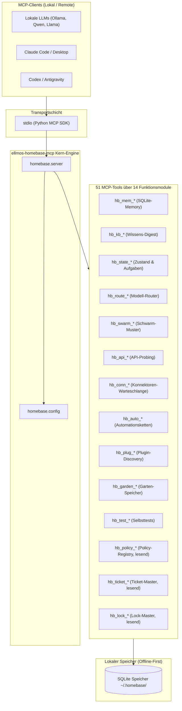
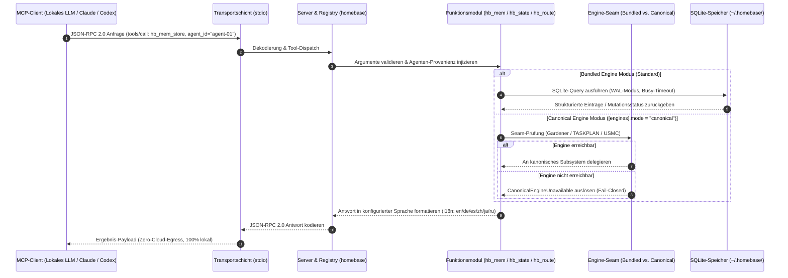

# ellmos-homebase-mcp

<p align="center">
  
</p>

Alpha-MCP-Server für **lokal-zentrierte LLM-Orchestrierung (Local-First)**: Memory, Wissen, Routing, Schwarm-Muster, API-Probing, persistenter Zustand, Tests, Automationsplanung und Plugin-Discovery in einem einzigen stdio-Server.

Homebase ist primär für **lokale LLMs** konzipiert (Ollama, Qwen, Llama oder jedes lokal betriebene Modell über ein MCP-fähiges Harness). Sämtlicher persistenter Speicher nutzt SQLite ohne jede Cloud-Abhängigkeit. Externe LLM-Anbieter (Claude, Codex, Gemini, OpenAI) können sich ebenfalls als MCP-Clients verbinden; lokale, offline-fähige Setups sind jedoch das primäre Entwicklungsziel.

Englisches README: [README.md](README.md)

*Teil der [ellmos-ai](https://github.com/ellmos-ai)-Familie unter dem Dach von [open-bricks](https://github.com/open-bricks).*

[](https://github.com/open-bricks)
[](https://github.com/ellmos-ai)
[](https://opensource.org/licenses/MIT)
[](NOTICE)
[](https://www.npmjs.com/package/ellmos-homebase-mcp)
[](https://www.python.org/)
[](https://nodejs.org/)
[](https://github.com/ellmos-ai/ellmos-homebase-mcp)
[](SECURITY.md)
[-blueviolet.svg)](https://sqlite.org/)
[-blueviolet.svg)](https://modelcontextprotocol.io/)
[](https://www.npmjs.com/package/ellmos-homebase-mcp)
[](tests/)
[](SECURITY.md)
[-success.svg)](SECURITY.md)
[](MARKETING-LOG.txt)
[](https://github.com/astral-sh/ruff)
[](llms.txt)
[](https://github.com/ellmos-ai/ellmos-homebase-mcp/actions/workflows/tests.yml)

**Auffindbarkeit:** Veröffentlicht auf [npm](https://www.npmjs.com/package/ellmos-homebase-mcp) als `ellmos-homebase-mcp` und gepflegt in der Organisation [`ellmos-ai`](https://github.com/ellmos-ai).

> [!NOTE]
> **Für KI-Assistenten & LLM-Agenten:** Eine maschinenlesbare Architekturübersicht, Index und Werkzeugfähigkeiten sind in [llms.txt](llms.txt) bereitgestellt. MCP-Registry-Metadaten sind in [server.json](server.json) verfügbar.

## Schnellnavigation / Quick Navigation

- [Systemarchitektur](#systemarchitektur) (`#sec-01`)
- [Sequenzablauf & Lebenszyklus](#sequenzablauf--lebenszyklus) (`#sec-02`)
- [Kernfähigkeiten & Sicherheitsinvarianten](#kernfähigkeiten--sicherheitsinvarianten) (`#sec-03`)
- [Governance & Laufzeit-Invarianten](#governance--laufzeit-invarianten) (`#sec-04`)
- [Zielgruppen & Auffindbarkeit](#zielgruppen--auffindbarkeit) (`#sec-05`)
- [Vergleichsmatrix gegenüber Alternativen](#vergleichsmatrix-gegenüber-alternativen) (`#sec-06`)
- [Einstieg](#einstieg) (`#sec-07`)
- [Status](#status) (`#sec-08`)
- [Installation](#installation) (`#sec-09`)
- [MCP-Client-Konfiguration](#mcp-client-konfiguration) (`#sec-10`)
- [Server-Konfiguration](#server-konfiguration) (`#sec-11`)
- [Tools](#tools) (`#sec-12`)
- [Discovery-Kontext](#discovery-kontext) (`#sec-13`)
- [ellmos-ai-Ökosystem](#ellmos-ai-ökosystem) (`#sec-14`)
- [Drittanbieter-Lizenzen & Level 1 SBOM](#drittanbieter-lizenzen) (`#sec-15`)
- [Sicherheit & Schwachstellenmeldung](#sicherheit--schwachstellenmeldung) (`#sec-16`)
- [Entwicklung](#entwicklung) (`#sec-17`)
- [Lizenz & Gesetzlicher Haftungsausschluss (§ 521 BGB)](#lizenz--gesetzlicher-haftungsausschluss) (`#sec-18`)
- [Marketing-Log (MARKETING-LOG.txt)](MARKETING-LOG.txt) | [Änderungsprotokoll (CHANGELOG.md)](CHANGELOG.md) | [Urheberrechtshinweis (NOTICE)](NOTICE) | [Englische Version (README.md)](README.md)

---

<a id="sec-01"></a><a id="systemarchitektur"></a>
## Systemarchitektur



---

<a id="sec-02"></a><a id="sequenzablauf--lebenszyklus"></a>
## Sequenzablauf & Lebenszyklus



---

<a id="sec-03"></a><a id="kernfähigkeiten--sicherheitsinvarianten"></a>
## Kernfähigkeiten & Sicherheitsinvarianten

| Fähigkeit / Invariante | Garantie | Technische Umsetzung |
|---|---|---|
| **100% Local-First & Zero-Egress** | Vollständige Privatsphäre und Offline-Betrieb; keinerlei unerwartete Cloud-Kommunikation oder Telemetrie. | Sämtlicher persistenter Speicher für Memory, Wissen und Tasks liegt in lokalem SQLite (`~/.homebase/`). |
| **Strikte Engine-Seams & Fail-Closed** | Kein stiller Fallback in isolierte Datenbanken beim Anfordern kanonischer Systeme. | Durchsetzung via [`MODE-CONTRACT.md`](MODE-CONTRACT.md): löst `CanonicalEngineUnavailable` aus, falls Ziel unerreichbar. |
| **Team-Memory Provenienz (`agent_id`)** | Deterministischer Audit-Trail und filterbare Zuständigkeiten für Multi-Agenten-Systeme. | Native `agent_id`-Erfassung über Fakten, Wissenseinträge und Aufgabenstatus hinweg. |
| **Credential-Free Discovery & Planung** | Null Offenlegung von Geheimnissen bei Modell-Routing und API-Probing. | `hb_route_*`, `hb_swarm_*` und `hb_api_*` operieren ohne Übertragung privater API-Keys oder Token. |
| **Sichere Plan-and-Queue Adapter** | Sicheres Staging von Warteschlangen und Ketten ohne unkontrollierte Remote-Ausführung. | `hb_conn_*` und `hb_auto_*` führen reine Planungs-Warteschlangen und Offline-Staging-Manifeste. |
| **Vollständige native i18n-Lokalisierung** | Barrierefreie mehrsprachige Interaktion für Entwickler und Agenten. | Lokalisierte Tool-Beschreibungen und Schemas für `en`, `de`, `es`, `zh`, `ja`, `ru`. |
| **Rechte-Nicht-Eskalation & Hygiene** | Unprivilegierte Ausführung und strikter Ausschluss von Anmeldedaten aus Distributionen. | Non-Root-Kompatibilität; Live-Konfigurationen und Secrets werden via `.gitignore` und `.npmignore` ignoriert. |
| **Multi-OS CI Smoke Integrität** | Verifizierte plattformübergreifende Zuverlässigkeit auf allen großen Betriebssystemen. | Mehrstufige CI-Matrix für Python 3.10–3.13 und Node.js 20–24 unter Linux/Windows/macOS. |

---

<a id="sec-04"></a><a id="governance--laufzeit-invarianten"></a>
## Governance & Laufzeit-Invarianten

| Invarianten-ID | Titel & Geltungsbereich | Garantie & Technische Durchsetzung | Verifikations-Seam |
|---|---|---|---|
| **`INV-LOCAL-01`** | **100% Local-First & Zero-Egress** | Alle persistenten Speicher, Wissenseinträge und Task-Zustände liegen lokal in SQLite (`~/.homebase/`). Keine Telemetrie, Analyse oder unaufgeforderte Cloud-Netzwerkaufrufe. | `tests/test_server_transport.py`, `tests/test_repository_hygiene.py` |
| **`INV-ENGINE-02`** | **Strikte Engine-Seams & Fail-Closed** | Durchsetzung via [`MODE-CONTRACT.md`](MODE-CONTRACT.md): `[engines].mode = "canonical"` fällt niemals still auf bundled zurück, wenn die kanonische Engine unerreichbar ist. | `tests/test_engine_seams.py` |
| **`INV-SEAM-03`** | **Canonical-Only Isolation** | `hb_policy_*`, `hb_ticket_*` und `hb_lock_*` bieten reine Lese-Sichten auf policy-registry, ticket-master und lock-master. Sie besitzen kein bundled Imitat und scheitern fail-closed. | `tests/test_new_seams.py` |
| **`INV-PROV-04`** | **Deterministische Provenienz & Team-Memory** | Multi-Agenten-Koordination erfordert strikte Zuordnung. Alle Fakten und Task-Übergänge speichern `agent_id`-Attribute mit SQLite-WAL-Parallelität und Busy-Timeouts. | `tests/test_module_contracts.py` |
| **`INV-CRED-05`** | **Credential-Free Discovery & Probing** | Modell-Routing-Empfehlungen (`hb_route_*`), Schwarmmuster-Vorlagen (`hb_swarm_*`) und API-Schema-Probing (`hb_api_*`) arbeiten ohne private Tokens oder API-Schlüssel. | `tests/test_module_contracts.py` |
| **`INV-STAGE-06`** | **Plan-Only Staging & Bounded Offline Queues** | Konnektoren-Queues (`hb_conn_*`) und Automationspläne (`hb_auto_*`) erfassen Offline-Blueprints und Dry-Run-Manifeste ohne Ausführung willkürlichen Remote-Codes. | `tests/test_module_contracts.py` |
| **`INV-I18N-07`** | **Native mehrsprachige Schema-Parität** | Alle 51 Tool-Definitionen, Eingabeschemas und Validierungsfehler besitzen 100% vollständige Lokalisierung in 6 Sprachen (`en`, `de`, `es`, `zh`, `ja`, `ru`). | `tests/test_i18n_completeness.py` |
| **`INV-PERM-08`** | **Rechte-Nicht-Eskalation & RunAsInvoker** | Homebase läuft strikt im unprivilegierten Benutzerraum. Es benötigt keinerlei Administrator- oder Root-Rechte und ignoriert sensitive Dotfiles und Systemanmeldedaten. | `tests/test_repository_hygiene.py` |
| **`INV-SYNC-09`** | **Multi-Host Lock- & Konflikt-Disziplin** | Strikter Ausschluss von Konfliktkopien (`*.sync-conflict-*`, `*-conflict-*`) und Beachtung von Multi-Agenten-Sperrmechanismen (`LOCK.*`, `*.lock`). | `tests/test_metadata.py` |
| **`INV-SLA-10`** | **48h Antwort, 5-Tage-Triage & 30-Tage-Behebung SLA** | Sicherheitsmeldungen an `security@ellmos.ai`, `support@lukasgeiger.com` oder `security@open-bricks.org` erhalten garantierte Erstantwort in <=48h, Triage in 5 Werktagen und Behebung in 30 Tagen. | `SECURITY.md`, `tests/test_metadata.py` |

---

<a id="sec-05"></a><a id="zielgruppen--auffindbarkeit"></a>
## Zielgruppen & Auffindbarkeit

Homebase wurde speziell entwickelt, um architektonische und operative Herausforderungen von vier primären technischen Zielgruppen zu lösen:

### `[PERSONA-01]` Entwickler lokaler LLMs & Edge-KI
- **Profil & Ziel:** KI-Entwickler, die Offline- oder Edge-Anwendungen mit Ollama-, Qwen- oder Llama-Modellen erstellen und ein zuverlässiges Orchestrierungs-Harness benötigen.
- **Herausforderungen:** Cloud-Memory-APIs verursachen ungewollte Latenzen, Datenschutzrisiken, Abo-Kosten und Netzwerkausfälle.
- **Homebase-Lösung:** Keine Cloud-Abhängigkeiten, lokale SQLite WAL-Persistenz (`~/.homebase/`) und 51 Standard-stdio-Tools für Gedächtnis, FTS5-Wissenssuche und Task-Tracking.
- **Referenz-Workflow:**
  ```json
  {"tool": "hb_mem_store", "arguments": {"fact": "Benutzer bevorzugt kompakte JSON-Ausgabe", "agent_id": "ollama-coder"}}
  {"tool": "hb_kb_search", "arguments": {"query": "API routing rules", "fts": true}}
  ```

### `[PERSONA-02]` Multi-Agent Swarm Orchestrators & Swarm Architects
- **Profil & Ziel:** Systemarchitekten, die Multi-Agenten-Kollektive (Claude Code, Codex, Antigravity, lokale Agenten) auf gemeinsamen Codebases koordinieren.
- **Herausforderungen:** Zustandskollisionen, fehlende Herkunftsnachweise, Race-Conditions in geteilten Speichern und unkoordinierte Aufgabenübergaben.
- **Homebase-Lösung:** Native `agent_id`-Provenienz für alle Fakten, Erinnerungen und Task-Zustände; integrierte Schwarm-Muster (Boss/Worker, parallele Chunks, Consensus-Voting via `hb_swarm_*`).
- **Referenz-Workflow:**
  ```json
  {"tool": "hb_swarm_plan", "arguments": {"goal": "Sicherheits-Seams auditieren", "pattern": "consensus"}}
  {"tool": "hb_state_task_create", "arguments": {"title": "Fail-Closed-Modus verifizieren", "agent_id": "worker-audit-01"}}
  ```

### `[PERSONA-03]` Enterprise Security & Data Governance Officers
- **Profil & Ziel:** CISOs, SecOps-Teams und Compliance-Auditoren in regulierten Branchen (Gesundheitswesen, Finanzen, öffentliche Hand), die KI-Toolchains bewerten.
- **Herausforderungen:** Intransparente Cloud-Telemetrie, unüberprüfte Remote-Seiteneffekte, Privilegien-Eskalationsrisiken und fehlende SLA-Zusagen.
- **Homebase-Lösung:** Strikte Zero-Egress-Architektur, Fail-Closed kanonische Engine-Seams (`MODE-CONTRACT.md`), unprivilegierter `RunAsInvoker`-Betrieb und verbindliche 48h Security Response SLA (`SECURITY.md`).
- **Referenz-Workflow:**
  ```json
  {"tool": "hb_policy_list_rules", "arguments": {}}
  ```
  *Garantiertes Fail-Closed-Verhalten: Löst `CanonicalEngineUnavailable` aus, statt still auf unsichere Stubs auszuweichen.*

### `[PERSONA-04]` Cross-Framework AI Assistants & Pair Programmers
- **Profil & Ziel:** Entwickler, die mehrere KI-Assistenten (Claude Desktop, Codex, Cursor, Gemini) parallel einsetzen und einheitliche Werkzeug-Parität erwarten.
- **Herausforderungen:** Inkompatible Werkzeug-Schnittstellen, fragmentierte Notizen und fehlende mehrsprachige Entwickler-Schemas.
- **Homebase-Lösung:** Standardisiertes stdio MCP-Transportprotokoll, maschinenlesbare Metadaten (`llms.txt`, `server.json`, `glama.json`) und vollständige Lokalisierung in 6 Sprachen (`en`, `de`, `es`, `zh`, `ja`, `ru`).
- **Referenz-Workflow:**
  ```json
  {"tool": "hb_ticket_list", "arguments": {"folder": "ACTIVE"}}
  ```

---

<a id="sec-06"></a><a id="vergleichsmatrix-gegenüber-alternativen"></a>
## Vergleichsmatrix gegenüber Alternativen

Homebase bietet einen umfassenden, lokal-zentrierten Funktionsumfang im direkten Vergleich zu cloud-basierten oder isolierten Alternativen:

| Architektur- & Laufzeitdimension | `ellmos-homebase-mcp` | Cloud Memory SaaS (Letta, Pinecone, LangSmith) | Generische Memory-MCPs (mcp-server-memory, sqlite) | Schwere Agenten-Frameworks (CrewAI, AutoGen, LangGraph) | Ad-Hoc Skripte / Benutzer-SQLite |
|---|---|---|---|---|---|
| **1. 100% Local-First & Zero Egress (`INV-LOCAL-01`)** | **Ja (100% lokales SQLite WAL, null Telemetrie)** | Nein (Cloud-hosted, obligatorischer Egress) | Teilweise (Lokale Datei, aber ohne strikte Garantien) | Variabel (Erfordert häufig Cloud-API-Schlüssel) | Ja (Lokal, aber ohne standardisiertes Protokoll) |
| **2. Engine-Seams & Fail-Closed (`INV-ENGINE-02`)** | **Ja (Strikter `MODE-CONTRACT.md`, wirft Fehler bei Ausfall)** | Nein (Undurchsichtige Cloud-Failovers) | Nein (Fest verdrahtetes Backend) | Nein (Unbehandelte Ausnahmen / stiller Fallback) | Nein (Ad-Hoc Fehlerbehandlung) |
| **3. Canonical-Only Seams (`INV-SEAM-03`)** | **Ja (`hb_policy_*`, `hb_ticket_*`, `hb_lock_*` fail-closed)** | Nein (Kein kanonisches Systemverständnis) | Nein (Keine Integration für Governance/Locks) | Nein (Keine Governance-Seams) | Nein (Manuelle Koordination) |
| **4. Team-Memory & Attribution (`INV-PROV-04`)** | **Ja (Native `agent_id` auf Fakten, Wissen, Tasks)** | Teilweise (Nur Benutzerebene, keine Agentenfilter) | Nein (Einzelner globaler Graph) | Teilweise (Nur im RAM, nach Neustart verloren) | Nein (Manuelle Schemapflege) |
| **5. Credential-Free Discovery (`INV-CRED-05`)** | **Ja (Offline-Routing & Schwarmplanung ohne Token)** | Nein (Erfordert aktive bezahlte Cloud-Zugänge) | Nein (Keine Routing- oder Schwarmtools) | Nein (Erfordert API-Keys für LLM-Planung) | Nein (Keine Strukturplanung) |
| **6. Plan-Only Staging Queues (`INV-STAGE-06`)** | **Ja (Sichere Konnektoren-Queues & Dry-Run Automation)** | Nein (Direktausführung oder keine) | Nein (Keine Konnektoren-/Automationsunterstützung) | Nein (Direkte Laufzeit-Seiteneffekte) | Nein (Unsichere Ausführung) |
| **7. Werkzeugbreite & Oberfläche** | **51 Tools über 14 Module in einem einzigen stdio-Server** | 1-5 API-Endpunkte | 2-5 elementare Tools | Framework-Bibliothek (nicht nativ MCP) | Fragmentierte CLI-Skripte |
| **8. Mehrsprachige Schema-Parität (`INV-I18N-07`)** | **Ja (Vollständige Abdeckung: en, de, es, zh, ja, ru)** | Nur Englisch | Nur Englisch | Nur Englisch | Nur Englisch / Keine |
| **9. Nicht-Eskalationssicherheit (`INV-PERM-08`)** | **Ja (Unprivilegierter RunAsInvoker-Betrieb)** | Cloud SaaS (Tenant-Isolationsmodell) | Variabel (Lokale Dateiberechtigungen) | Variabel (Läuft oft in Root-Containern) | Variabel (Benutzerskripte) |
| **10. Sicherheits-SLA (`INV-SLA-10`)** | **Ja (Verbindlich 48h Antwort, 5d Triage & 30d Behebung in `SECURITY.md`)** | Kommerzielles SLA (nur Bezahlpläne) | Keine / Community Best-Effort | Keine / Community Best-Effort | Keine |

---

<a id="sec-07"></a><a id="einstieg"></a>
## Einstieg

| Anforderung | Einstiegspunkt |
|---|---|
| Installation des Alpha-MCP-Servers | `npm install -g ellmos-homebase-mcp@alpha` |
| Starten aus einem Quell-Checkout | `python -m homebase.server` mit `PYTHONPATH=src` |
| Lokales LLM-Harness, Claude Code, Codex oder beliebigen MCP-Client anbinden | [MCP-Client-Konfiguration](#mcp-client-konfiguration) |
| Maschinenlesbare Projektübersicht einsehen | [llms.txt](llms.txt) |
| Registry-Metadaten prüfen | [server.json](server.json) |

---

<a id="sec-08"></a><a id="status"></a>
## Status

- Transport: stdio über das offizielle Python MCP SDK
- Paketstatus: Öffentliches Alpha-Paket unter `ellmos-ai`
- Release-Metadaten: MIT `LICENSE`, `NOTICE`, `CHANGELOG.md`, `llms.txt` und MCP Registry-Metadaten in `server.json`
- Test-Schranke: GitHub Actions deckt Python 3.10/3.11/3.12/3.13 sowie Node.js 20/22/24 Smoke- und npm-Paket-Checks ab
- Aktueller Kern: Modul-Erkennung, MCP-Tool-Listing, Tool-Dispatch, Konfigurations-Fallbacks, lokale Planungs-, Probing-, Queue- und Dry-Run-Adapter
- Reale lokale SQLite-Module: `hb_mem_*`, `hb_kb_*`, `hb_garden_*`, `hb_state_*`
- Engine-Seams: `hb_garden_*`, `hb_state_task_*` und `hb_mem_*` können an die echten,
  kanonischen Gardener/Rinnsal/USMC-Engines delegieren via `[engines].mode = "canonical"`
  (Standard bleibt `"bundled"` für eine installationsfreie Nutzung).
  **Kein stiller Fallback:** Wenn `canonical` gewählt wurde und die Engine nicht erreichbar ist,
  geben diese Tools einen Fehler zurück, anstatt still die lokale DB zu nutzen.
  Verbindliche Regel und Migrationshinweise: **[MODE-CONTRACT.md](MODE-CONTRACT.md)**;
  Mechanismus: [KONZEPT.md](KONZEPT.md#engine-seams-canonicalbundled--umsetzungsstand-2026-07-04-ticket-t-20260704-01).
- Canonical-Only Seams (keine lokale Alternative vorhanden): `hb_policy_*` (policy-registry),
  `hb_ticket_*` (ticket-master), `hb_lock_*` (lock-master) – in v1 ausschließlich lesend.
  Eine lokal gefälschte Kopie von Richtlinien/Tickets/Sperren würde täuschen; diese drei
  versuchen stets das kanonische Modul und schlagen fail-closed fehl, wenn es unerreichbar ist.
- Team-Memory Grundlagen: `agent_id`-Herkunft und Filter für Memory, Wissen, State-Memory und Aufgaben; SQLite nutzt WAL-Modus plus Busy-Timeout für sicherere Nebenläufigkeit
- Credential-freie Alpha-Adapter: `hb_route_*`, `hb_swarm_*`, `hb_api_*`, `hb_test_*`, `hb_conn_*`, `hb_auto_*`, `hb_plug_*`
- i18n: Vollständig lokalisierte Tool-Beschreibungen, Schema-Feld-Texte und Fehlermeldungen für `en`, `de`, `es`, `zh`, `ja`, `ru` (Englischer Fallback bei fehlendem Schlüssel)
- Roadmap: Optionale echte LLM/API-Integrationen und explizite Ausführungs-Backends

---

<a id="sec-09"></a><a id="installation"></a>
## Installation

Das npm-Paket enthält einen Node-Wrapper, der den Python-Server startet. Erforderlich sind Python 3.10+ und das Python-Paket `mcp>=1.0.0`.

### Option 1: Installation über npm

```powershell
npm install -g ellmos-homebase-mcp@alpha
ellmos-homebase
```

### Option 2: Installation aus den Quellen

```powershell
git clone https://github.com/ellmos-ai/ellmos-homebase-mcp.git
cd ellmos-homebase-mcp
$env:PYTHONIOENCODING = "utf-8"
python -m pip install -e ".[dev]"
python -m pytest -ra -v
```

Vermeide das Erstellen einer `.venv` in Cloud-synchronisierten Ordnern, falls der Sync-Client Dateien sperrt.

### Start aus den Quellen

```powershell
$env:PYTHONPATH = "src"
python -m homebase.server
```

---

<a id="sec-10"></a><a id="mcp-client-konfiguration"></a>
## MCP-Client-Konfiguration

Homebase nutzt das standardisierte stdio `mcpServers`-Konfigurationsformat.

### Globale npm-Installation

```json
{
  "mcpServers": {
    "homebase": {
      "command": "ellmos-homebase"
    }
  }
}
```

### Quelltext-Checkout

```json
{
  "mcpServers": {
    "homebase": {
      "command": "python",
      "args": ["-m", "homebase.server"],
      "env": {
        "PYTHONPATH": "/absoluter/pfad/zu/ellmos-homebase-mcp/src"
      }
    }
  }
}
```

---

<a id="sec-11"></a><a id="server-konfiguration"></a>
## Server-Konfiguration

Beispiel: [config/homebase.example.toml](config/homebase.example.toml)

Standardpfade:
- `%USERPROFILE%\.homebase\homebase.toml`
- `%USERPROFILE%\.config\homebase\homebase.toml`
- überschreibbar mit `HOMEBASE_CONFIG`

Die Sprache kann über `[server].language`, `HOMEBASE_LANG` oder `HOMEBASE_LOCALE` festgelegt werden.
Der schreibende Agent kann pro Aufruf als `agent_id` übergeben werden; andernfalls nutzen die Module
`HOMEBASE_AGENT_ID`, `AGENT_ID`, ein modulspezifisches `agent_id` oder `unknown`.

```toml
[server]
name = "ellmos-homebase"
language = "de" # en, de, es, zh, ja, ru

[modules]
enabled = ["mem", "route", "kb", "swarm", "state", "garden", "api", "test", "conn", "auto", "plug"]
```

---

<a id="sec-12"></a><a id="tools"></a>
## Tools

Wichtige Modulgruppen:

- `hb_mem_*` für SQLite-gespeichertes Gedächtnis
- `hb_kb_*` für SQLite-gespeichertes Wissen
- `hb_state_*` für persistenten Zustand und Aufgaben
- `hb_garden_*` für Wissensgärten
- `hb_route_*` für schlüssellose Modell-Empfehlungen
- `hb_swarm_*` für schlüssellose Schwarm-Planungsmuster
- `hb_api_*` für passive HTTP-API-Erkundung mit Historie
- `hb_test_*` für Selbsttests
- `hb_conn_*` für Konnektoren-Verwaltung und Warteschlangen
- `hb_auto_*` für Automationsketten-Definitionen
- `hb_plug_*` für Plugin-Erkundung
- `hb_policy_*` (lesend, nur kanonisch) für Richtlinienabfragen
- `hb_ticket_*` (lesend, nur kanonisch) für Ticketübersichten
- `hb_lock_*` (lesend, nur kanonisch) für Sperrprüfungen

---

<a id="sec-13"></a><a id="discovery-kontext"></a>
## Discovery-Kontext

Verwende `ellmos-homebase-mcp`, wenn nach einem lokalen, offline-fähigen MCP-Server gesucht wird, der lokalen LLMs (Ollama, Qwen, Llama o. ä.) persistentes Gedächtnis, Wissensverwaltung, Routing und Orchestrierung bereitstellt – ohne Cloud-Zwang.

Empfohlene Suchbegriffe:
- `ellmos Homebase MCP server`
- `local-first LLM orchestration MCP`
- `MCP server SQLite memory knowledge routing`
- `offline agent orchestration MCP server`
- `MCP swarm planning persistent state API discovery`

---

<a id="sec-14"></a><a id="ellmos-ai-ökosystem"></a>
## ellmos-ai-Ökosystem

Dieser MCP-Server ist Teil des **[ellmos-ai](https://github.com/ellmos-ai)**-Ökosystems – KI-Infrastruktur, MCP-Server und intelligente Werkzeuge.

### MCP-Server-Familie

| Server | Tools | Fokus | npm |
|--------|-------|-------|-----|
| [FileCommander](https://github.com/ellmos-ai/ellmos-filecommander-mcp) | 47 | Dateisystem, Prozessmanagement, interaktive Sitzungen | [`ellmos-filecommander-mcp`](https://www.npmjs.com/package/ellmos-filecommander-mcp) |
| [CodeCommander](https://github.com/ellmos-ai/ellmos-codecommander-mcp) | 23 | Code-Analyse, JSON-Reparatur, Imports, Diffs | [`ellmos-codecommander-mcp`](https://www.npmjs.com/package/ellmos-codecommander-mcp) |
| [Clatcher](https://github.com/ellmos-ai/ellmos-clatcher-mcp) | 12 | Dateireparatur, Formatkonvertierung, Stapelverarbeitung | [`ellmos-clatcher-mcp`](https://www.npmjs.com/package/ellmos-clatcher-mcp) |
| [n8n Manager](https://github.com/ellmos-ai/n8n-manager-mcp) | 19 | n8n-Workflow-Management via KI-Assistenten | [`n8n-manager-mcp`](https://www.npmjs.com/package/n8n-manager-mcp) |
| [ControlCenter](https://github.com/ellmos-ai/ellmos-controlcenter-mcp) | 20 | MCP-Stack-Erkennung, Profilverwaltung, Steuerung | [`ellmos-controlcenter-mcp`](https://www.npmjs.com/package/ellmos-controlcenter-mcp) |
| **[Homebase](https://github.com/ellmos-ai/ellmos-homebase-mcp)** | **51** | **Lokales LLM-Gedächtnis, Wissen, Zustand, Routing, Schwarm-Orchestrierung** | **[`ellmos-homebase-mcp`](https://www.npmjs.com/package/ellmos-homebase-mcp)** (Alpha) |
| [ServerCommander](https://github.com/ellmos-ai/ellmos-servercommander-mcp) | 8 | Server-Betrieb: Health-Checks, Log-Analyse, Deploy-Dry-Runs | [`ellmos-servercommander-mcp`](https://www.npmjs.com/package/ellmos-servercommander-mcp) (Alpha) |
| [Blender Use](https://github.com/ellmos-ai/ellmos-blender-use-mcp) | 3 | Headless Blender-Asset-QS und FBX-Verifikation | [`ellmos-blender-use-mcp`](https://www.npmjs.com/package/ellmos-blender-use-mcp) (Alpha) |
| [Open Compute](https://github.com/ellmos-ai/open-compute-mcp) | 10 | Modell-unabhängige Computer-Nutzung: UI-Automatisierung | [`open-compute-mcp`](https://www.npmjs.com/package/open-compute-mcp) (Alpha) |

### KI-Infrastruktur

| Projekt | Beschreibung |
|---------|-------------|
| [BACH](https://github.com/ellmos-ai/bach) | Lokales textbasiertes Betriebssystem für KI-Agenten – 113+ Handler, 550+ Tools |
| [open-compute](https://github.com/ellmos-ai/open-compute) | Computer-Use-Kern zur Steuerung von Desktops |
| [clutch](https://github.com/ellmos-ai/clutch) | Modell-neutrales LLM-Routing und Budget-Tracking |
| [rinnsal](https://github.com/ellmos-ai/rinnsal) | Leichtgewichtige Agenten-Speicher- und Automationsinfrastruktur |
| [ellmos-stack](https://github.com/ellmos-ai/ellmos-stack) | Selbst gehosteter KI-Forschungs-Stack |
| [MarbleRun](https://github.com/ellmos-ai/MarbleRun) | Autonome Agentenketten für Claude Code |
| [gardener](https://github.com/ellmos-ai/gardener) | Minimalistischer, datenbankgestützter LLM-OS-Prototyp |
| [ellmos-tests](https://github.com/ellmos-ai/ellmos-tests) | Test-Framework für LLM-Betriebssysteme |

### Desktop-Software & Partner-Ökosystem

Unsere Partner-Dachorganisation **[open-bricks](https://github.com/open-bricks)** und Schwesterorganisationen pflegen datenschutzkonforme, lokale Desktop-Software und Entwickler-Tools:

| Anwendung / Werkzeug | Organisation | Fokus & Integration |
|---|---|---|
| [ProFiler](https://github.com/file-bricks/ProFiler) | `file-bricks` | Lokale Desktop-Dateiverwaltung und DSGVO-sicherer Workspace-Austausch |
| [DokuZen](https://github.com/doc-bricks/DokuZen) | `doc-bricks` | Ablenkungsfreier Markdown- & PDF-Dokumentationsmanager |
| [PDFtoPDFocr](https://github.com/doc-bricks/PDFtoPDFocr) | `doc-bricks` | Lokales PDF-OCR und Einbettung von Textebenen |
| [KnowledgeDigest](https://github.com/doc-bricks/KnowledgeDigest) | `doc-bricks` | Offline-Dokumentenzusammenfassung und Embedding-Engine |
| [DevCenter](https://github.com/dev-bricks/DevCenter) | `dev-bricks` | Entwickler-Arbeitsplatz-Hub und Multi-Repository-Management |
| [CodeBox](https://github.com/dev-bricks/CodeBox) | `dev-bricks` | Isolierter Sandbox-Runner und lokaler Code-Ausführungsassistent |
| [MemoryHooker](https://github.com/ellmos-ai/memoryhooker-provenance) | `ellmos-ai` | Hook-basierte LLM-Memory-Provenienz und Sitzungsinjektions-Gate |
| [sqlite-transit-sync](https://github.com/ellmos-ai/sqlite-transit-sync) | `ellmos-ai` | Abhängigkeitsfreie SQLite-Schemamigration und Replikationsschicht |

---

<a id="sec-15"></a><a id="drittanbieter-lizenzen"></a>
## Drittanbieter-Lizenzen & Level 1 SBOM

`ellmos-homebase-mcp` enthält nachweislich 0% Copyleft-Abhängigkeiten. Alle Laufzeitabhängigkeiten sind permissiv lizenziert (MIT, BSD-2-Clause, Apache-2.0, PSFL).

Das vollständige Verzeichnis, die Level 1 SBOM Invarianten-Kreuzreferenzmatrix sowie die Nicht-Eskalationszertifizierung (`RunAsInvoker`) sind in [THIRD_PARTY_LICENSES.md](THIRD_PARTY_LICENSES.md) dokumentiert. Die verbindliche Urheberrechtsangabe ist in [NOTICE](NOTICE) gepflegt.

---

<a id="sec-16"></a><a id="sicherheit--schwachstellenmeldung"></a>
## Sicherheit & Schwachstellenmeldung

`ellmos-homebase-mcp` befolgt strikt das Local-First-, Zero-Egress- und Non-Elevation-Sicherheitsprinzip. Vollständige Richtlinien und SLAs finden sich in [SECURITY.md](SECURITY.md):

- **Unterstützte Versionen**: `0.1.0-alpha.x`
- **Reaktions-SLA**: Erste Bestätigung und Triage innerhalb von **48 Stunden**. Detaillierte Einstufung binnen 5 Werktagen; Behebung innerhalb von 30 Kalendertagen.
- **Sicherheitskontakte**: `security@ellmos.ai`, `support@lukasgeiger.com` und `security@open-bricks.org`.
- **Sicherheitsmeldungen**: [GitHub Security Advisories](https://github.com/ellmos-ai/ellmos-homebase-mcp/security/advisories).

---

<a id="sec-17"></a><a id="entwicklung"></a>
## Entwicklung

```powershell
$env:PYTHONIOENCODING = "utf-8"
$env:PYTHONDONTWRITEBYTECODE = "1"
python -m pytest -ra -v
npm run smoke
npm pack --dry-run --json
```

---

<a id="sec-18"></a><a id="lizenz--gesetzlicher-haftungsausschluss"></a>
## Lizenz & Gesetzlicher Haftungsausschluss (§ 521 BGB)

### Softwarelizenz
`ellmos-homebase-mcp` ist Open-Source-Software unter der **[MIT-Lizenz](LICENSE)**.
Die verbindliche Namensnennung zugunsten von Lukas Geiger, der `ellmos-ai`-Familie und dem `open-bricks`-Ökosystem ist in [`NOTICE`](NOTICE) hinterlegt.
Die Lizenzen aller Drittanbieter-Komponenten sind in [`THIRD_PARTY_LICENSES.md`](THIRD_PARTY_LICENSES.md) erfasst.

### Gesetzlicher Hinweis & Haftungsbeschränkung (§ 521 BGB - Deutsches Recht)
Diese Software wird als Open-Source-Projekt unentgeltlich zur Verfügung gestellt. Gemäß den gesetzlichen Bestimmungen des deutschen Schenkungs- und Gefälligkeitsrechts (**§ 521 BGB**):
1. **Haftungsbeschränkung**: Die Haftung des Autors und der Mitwirkenden ist auf Vorsatz und grobe Fahrlässigkeit beschränkt.
2. **Gewährleistungsausschluss**: Gemäß §§ 523, 524 BGB ist die Gewährleistung für Sach- und Rechtsmängel ausgeschlossen, es sei denn, Mängel wurden arglistig verschwiegen (**arglistiges Verschweigen**).
3. **Local-First & Non-Elevation Prinzip**: `ellmos-homebase-mcp` wird im aktuellen Zustand ("as is") und ohne ausdrückliche oder stillschweigende Garantie bereitgestellt. Anwender betreiben Homebase im unprivilegierten Benutzermodus (`RunAsInvoker`) auf eigenes Risiko.

### Verbindliche Sicherheitsreaktions-SLA
Für Sicherheitsmeldungen garantiert unsere Richtlinie zur koordinierten Offenlegung eine Erstantwort innerhalb von **48 Stunden** und eine Einstufung innerhalb von 5 Werktagen:
- Sicherheitskontakt: `security@ellmos.ai` | `support@lukasgeiger.com` | `security@open-bricks.org`
- Advisory-Portal: [GitHub Security Advisories](https://github.com/ellmos-ai/ellmos-homebase-mcp/security/advisories)
- Sicherheitsrichtlinie: [`SECURITY.md`](SECURITY.md)

---

## Bundles und Partner

Homebase MCP bleibt ein eigenständiger, lokal-zentrierter MCP-Server. In der
V4-Komposition dient er als optionale **MCP-Zugriffsoberfläche** des
`ellmos-memory-human-context-bundle`: Ein konfiguriertes Gesamtsystem kann über
diesen Server auf Memory- und Human-Context-Fähigkeiten zugreifen. Diese Rolle
macht Homebase nicht zum kanonischen Eigentümer aller Memory-, Wissens-,
Zustands-, Routing- oder Automationsfunktionen; die ausgewählten Host- und
Systemmanifeste behalten ihre primären Bindungen.

Kanonische oder gebündelte Engines sind per expliziter Konfiguration
ausgewählte Integrationspartner, keine stillen Ersetzungen für diesen Server.
Verbindliche Bundle-Zugehörigkeiten, Versionen, Profile und private
Kompositionsrezepte verbleiben in den jeweiligen Bundle-Manifesten. Dieser
öffentliche Abschnitt dient ausschließlich der Auffindbarkeit.
